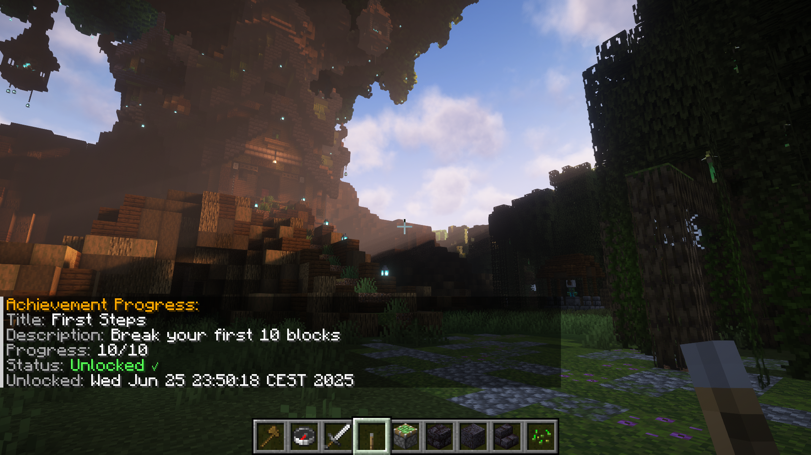
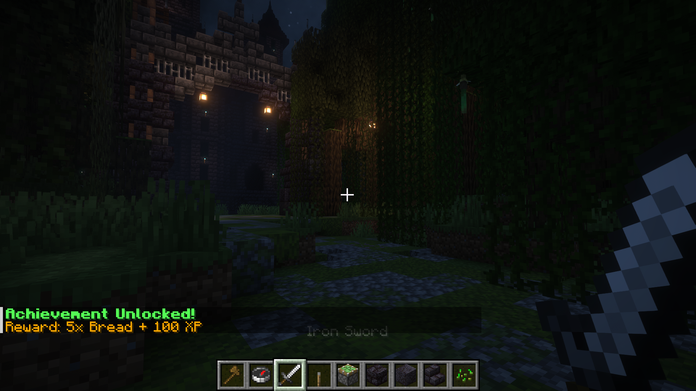
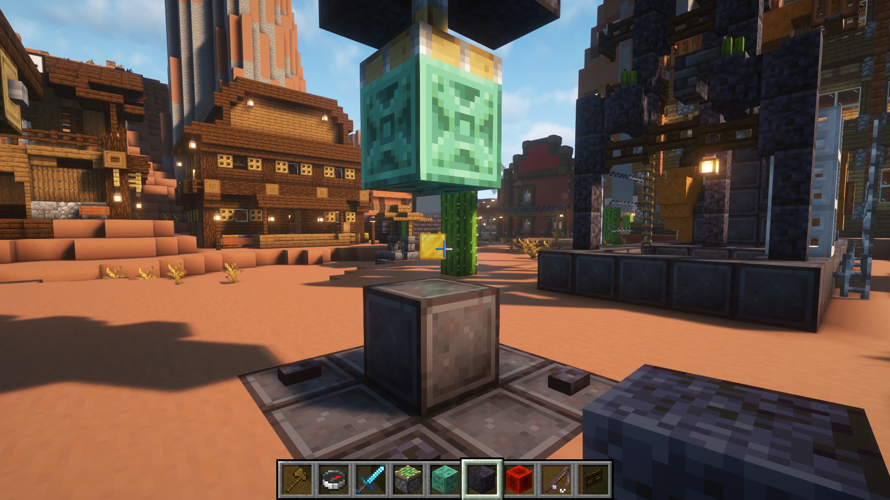
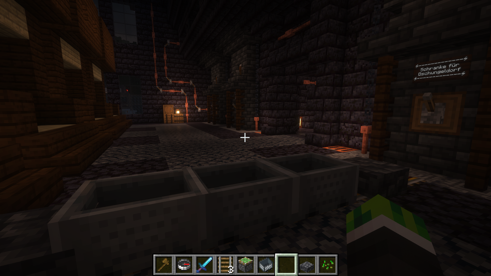
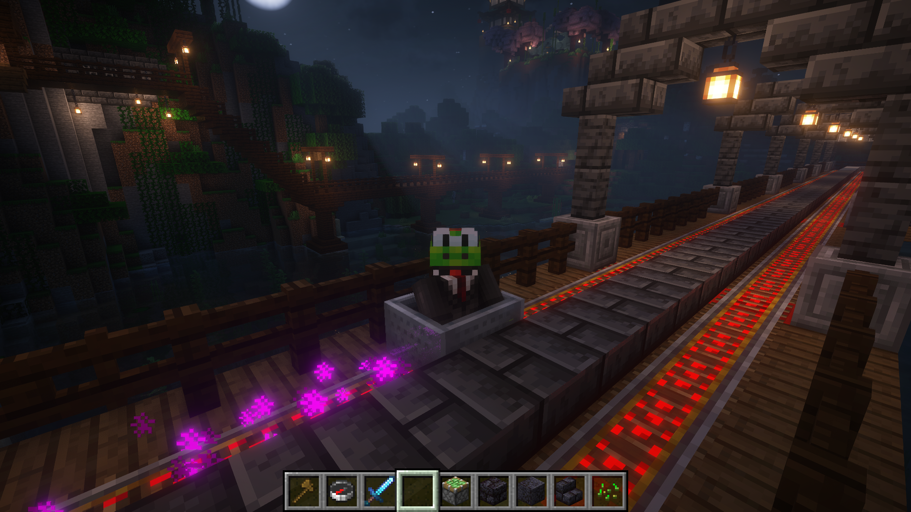
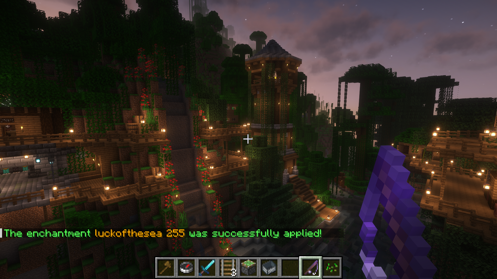

<p align="center">
  
</p>
<h1 align="center">Minecraft Server Plugins</h1>
<p align="center">
  <b>A collection of open-source Minecraft server plugins.</b><br>
  <b>Various enhancements for gameplay, administration, and server features.</b>
</p>
<p align="center">
  <a href="https://github.com/BerndHagen/Minecraft-Server-Plugins/releases"></a>&nbsp;&nbsp;<a href="https://github.com/BerndHagen/Minecraft-Server-Plugins/blob/main/LICENSE"></a>&nbsp;&nbsp;&nbsp;&nbsp;&nbsp;&nbsp;&nbsp;&nbsp;&nbsp;&nbsp;<a href="https://github.com/BerndHagen/Minecraft-Server-Plugins/issues"></a>
</p>

This collection provides **open-source Minecraft plugins** designed to add functionality to server gameplay. Each plugin is built with performance in mind and offers configuration options for server administrators.

Whether you're running a survival server, creative server, or custom game mode, these plugins provide additional features for your server. All plugins are released under the **MIT License**, allowing complete freedom to modify, distribute, and integrate them into your server environment.

### **Plugin Overview**

- **Advanced Achievements:** Comprehensive achievement system with custom rewards, progress tracking, and database integration
- **Piston Crusher:** Automated block crushing system using pistons with configurable materials and multipliers  
- **Rail Boost:** Enhanced minecart system with speed control, auto-pickup, storage, and advanced transportation features
- **Super Enchantments:** Advanced enchantment system allowing enchantments beyond vanilla limits with level 1-255 support

### **Key Features**

- **Open Source:** Complete source code available under MIT License for modification and improvement
- **Performance Optimized:** Efficient code designed for minimal server impact and smooth gameplay
- **Highly Configurable:** Extensive configuration options to customize behavior for your server needs
- **Database Integration:** Advanced data storage and player progress tracking capabilities
- **Modern API Support:** Built for Minecraft 1.19+ with backwards compatibility considerations
- **Admin Commands:** Comprehensive command systems for easy server management and configuration

### **Supported Platforms**

These plugins are compatible with major Minecraft server platforms:

- **Server Software:** `Spigot`, `Paper`, `Purpur`, `CraftBukkit`
- **Minecraft Versions:** `1.19+`, `1.20+`, `1.21+` (also compatible with higher versions)
- **Java Requirements:** `Java 17+`

### **Plugin Compatibility**

All plugins are designed to work seamlessly together and with popular server plugins:

- **Economy Integration:** Vault support for economy rewards and transactions
- **Permission Systems:** Compatible with LuckPerms, PermissionsEx, and other permission managers
- **WorldGuard Integration:** Respect region protections and building restrictions
- **Database Support:** MySQL, SQLite, and file-based storage options

## **Table of Contents**

1. [Getting Started](#getting-started)
    - [Prerequisites](#prerequisites)
    - [Installation Steps](#installation-steps)
    - [First Launch & Configuration](#first-launch--configuration)
    - [Verifying Installation](#verifying-installation)
2. [Advanced Achievements](#advanced-achievements)
    - [Core Features](#core-features-advanced-achievements)
    - [Administrative & Player Commands](#administrative--player-commands)
    - [Command Aliases](#command-aliases-advanced-achievements)
3. [Piston Crusher](#piston-crusher)
    - [Core Features](#core-features-piston-crusher)
    - [How It Works](#how-it-works)
    - [Example Setup (Piston Crusher)](#example-setup-piston-crusher)
    - [Administrative Commands](#administrative-commands)
    - [Important Notes](#important-notes-piston-crusher)
4. [Rail Boost](#rail-boost)
    - [Core Features](#core-features-rail-boost)
    - [Player Commands](#player-commands)
    - [Command Aliases](#command-aliases-rail-boost)
    - [Prerequisites for Commands](#prerequisites-for-commands-rail-boost)
5. [Super Enchantments](#super-enchantments)
    - [Core Features](#core-features-super-enchantments)
    - [How It Works](#how-it-works-1)
    - [Supported Enchantments](#supported-enchantments)
    - [Player Commands](#player-commands-1)
    - [Usage Examples](#usage-examples-super-enchantments)
    - [Command Requirements](#command-requirements-super-enchantments)
    - [Error Handling](#error-handling-super-enchantments)
6. [License](#license)
7. [Screenshots](#screenshots)

## **Getting Started**

### **Prerequisites**
- Minecraft server 1.19 or higher (Spigot, Paper, or compatible fork)
- Java 17 or newer (Java 21 recommended)
- (Optional) Vault for economy features, LuckPerms or PermissionsEx for permissions, MySQL for advanced database support

### **Installation Steps**
1. Download the latest plugin `.jar` files from the [Releases](https://github.com/BerndHagen/Minecraft-Server-Plugins/releases) page.
2. Stop your Minecraft server if it is running.
3. Copy the downloaded `.jar` files into your server's `plugins` folder.
4. (Optional) Add Vault, LuckPerms, or other dependencies to the `plugins` folder if needed.
5. Start your server again.

### **First Launch & Configuration**
- On first start, each plugin will generate its own configuration files in the `plugins/PluginName/` directory.
- Edit these config files as needed, or use in-game commands for setup (see plugin sections below).

### **Verifying Installation**
- Use `/plugins` in-game to check if the plugins are loaded and active.
- Use `/version <PluginName>` to check the version and status of each plugin.
- If a plugin does not load, check the server console for error messages (e.g., missing dependencies or wrong Java version).

For plugin-specific commands and advanced configuration, see the sections below.

## **Advanced Achievements**

A comprehensive achievement system that tracks player progress across multiple categories and provides customizable rewards. Features include progress tracking, database integration, and an intuitive GUI for players to view their achievements.

### Core Features (Advanced Achievements):
- **Progress Tracking:** Real-time tracking of player progress with percentage completion
- **Custom Rewards:** Configure economy rewards, items, commands, and experience points
- **Database Integration:** Persistent storage with MySQL and SQLite support
- **Interactive GUI:** User-friendly interface for browsing and tracking achievements
- **API Integration:** Developer API for creating custom achievement triggers
- **Message Customization:** Fully customizable achievement notifications and messages

### Administrative & Player Commands:

| Command | Description | Usage Example |
|---------|-------------|---------------|
| `/achievementadmin reload` | Reloads all plugin configuration files and achievement definitions | `/achievementadmin reload` |
| `/achievementadmin reset <player>` | Resets all achievement progress for the specified player | `/achievementadmin reset PlayerName` |
| `/achievementadmin give <player> <id>` | Manually awards a specific achievement to a player | `/achievementadmin give PlayerName first_kill` |
| `/achievementadmin stats` | Displays plugin statistics including total achievements and player counts | `/achievementadmin stats` |
| `/achievementadmin create` | Starts an interactive achievement creation process with step-by-step guidance | `/achievementadmin create` |
| `/achievementadmin delete <id>` | Permanently deletes an existing achievement by its unique identifier | `/achievementadmin delete custom_achievement` |
| `/achievementadmin edit <id>` | Opens the achievement editor for modifying existing achievement properties | `/achievementadmin edit mining_expert` |
| `/achievementadmin list [category] [page]` | Lists all achievements with optional category filtering and pagination | `/achievementadmin list combat 2` |
| `/achievementadmin progress [achievement_id]` | Displays current progress for all achievements or a specific achievement | `/achievementadmin progress mining_master` |
| `/achievementadmin info <achievement_id>` | Shows detailed information about a specific achievement including requirements | `/achievementadmin info first_diamond` |
| `/achievementadmin stats` | Displays personal achievement statistics and completion percentages | `/achievementadmin stats` |
| `/achievementadmin gui` | Opens the main achievements GUI interface for browsing and tracking progress | `/achievementadmin gui` |
| `/achievementadmin help` | Shows help information and available commands for the achievement system | `/achievementadmin help` |

### Command Aliases (Advanced Achievements):
- `/achievementadmin` can be used as `/achadmin` or `/ach` (all subcommands must be used as arguments, e.g. `/ach list`, `/ach gui`, etc.)
- There is no standalone `/ach` command; all commands are subcommands of `/achievementadmin` or its aliases.
- Most player commands support partial matching for achievement IDs

## **Piston Crusher**

An automation plugin that allows pistons to crush specific blocks into multiple items, creating efficient resource processing systems. Perfect for industrial-style servers and automated farms.

### Core Features (Piston Crusher):
- **Block Whitelist:** Configure which blocks can be crushed by pistons
- **Output Multiplier:** Adjust how many items are produced when blocks are crushed
- **Crusher Block Selection:** Choose which block type acts as the crusher mechanism
- **Admin Controls:** Easy configuration through in-game commands
- **Performance Optimized:** Efficient event handling for minimal server impact

### How It Works:
1. Configure which blocks can be crushed using the whitelist system
2. Place the configured crusher block (default: Polished Andesite) in your setup
3. Only the block directly in front of the crusher block (in the direction the crusher is facing) will be broken when activated
4. The broken block drops as a collectible item with the configured output multiplier
5. Perfect for creating automated mining systems and resource processing farms

### Example Setup (Piston Crusher)

To use the Piston Crusher, build the following structure:

```
[Sticky Piston] [Crusher Block] [Air] [Block to be crushed]
```

- **Sticky Piston:** Standard sticky piston
- **Crusher Block:** The block configured as the crusher (default: Polished Andesite)
- **Air:** An empty space (must be left open)
- **Block to be crushed:** Any block on the whitelist (e.g., COBBLESTONE)

**How it works:**
When you activate the sticky piston, it pushes the crusher block forward. As soon as the front face of the crusher block touches the block to be crushed, that block is instantly broken and drops the configured items.

ASCII diagram (side view):

```
[P] [C] [ ] [B]

P = Sticky Piston
C = Crusher Block (e.g., Polished Andesite)
  = Air (empty block)
B = Block to be crushed (whitelisted)
```

- The piston must be oriented so it pushes the crusher block toward the block to be crushed.
- Only the block directly in front of the crusher block will be broken when the piston extends.

### Administrative Commands:

| Command | Description | Usage Example |
|---------|-------------|---------------|
| `/pistoncrusher whitelist add <material>` | Adds a block type to the list of materials that can be crushed by pistons | `/pistoncrusher whitelist add COBBLESTONE` |
| `/pistoncrusher whitelist remove <material>` | Removes a block type from the crush whitelist | `/pistoncrusher whitelist remove STONE` |
| `/pistoncrusher whitelist list` | Displays all currently whitelisted block types that can be crushed | `/pistoncrusher whitelist list` |
| `/pistoncrusher multiplier <value>` | Sets the output multiplier for crushed blocks (minimum value: 1.0) | `/pistoncrusher multiplier 2.5` |
| `/pistoncrusher multiplier` | Shows the current output multiplier setting | `/pistoncrusher multiplier` |
| `/pistoncrusher crusherblock <material>` | Sets which block type acts as the crusher mechanism | `/pistoncrusher crusherblock POLISHED_ANDESITE` |
| `/pistoncrusher crusherblock` | Displays the current crusher block type and usage instructions | `/pistoncrusher crusherblock` |

### Important Notes (Piston Crusher):
- Material names must be valid Minecraft material identifiers (e.g., COBBLESTONE, STONE, IRON_ORE)
- The multiplier determines how many items are produced when a block is crushed
- The crusher block is the block that blocks must be pushed into for crushing to occur
- Tab completion is available for all material names

## **Rail Boost**

A comprehensive minecart enhancement plugin that transforms basic minecarts into powerful transportation and utility vehicles with speed control, storage, and automation features.

### Core Features (Rail Boost):
- **Variable Speed Control:** 6 different speed levels from 0.25x to 4.0x normal speed
- **Auto-Pickup System:** Configurable radius for automatic item collection while traveling
- **Built-in Storage:** Each minecart can carry items with inventory management
- **Speedometer Display:** Real-time speed indicator using boss bar display
- **Chunk Loading:** Keep chunks loaded while traveling for uninterrupted journeys
- **Magnetic Collection:** Advanced item attraction system with customizable range
- **Particle Effects:** Visual effects and customizable particle trails
- **Auto-Sit Feature:** Automatic boarding system for convenient transportation
- **Item Blacklist:** Configure which items should not be automatically collected

### Player Commands:

| Command | Description | Usage Example |
|---------|-------------|---------------|
| `/railboost speed <1-6>` | Sets minecart speed level from 1 (0.25x) to 6 (4.0x normal speed) | `/railboost speed 4` |
| `/railboost autopickup <true/false>` | Toggles automatic item pickup while traveling in the minecart | `/railboost autopickup true` |
| `/railboost autopickup radius <1-5>` | Sets the radius in blocks for automatic item pickup (1-5 blocks) | `/railboost autopickup radius 3` |
| `/railboost storage` | Opens the built-in storage inventory for the current minecart | `/railboost storage` |
| `/railboost speedometer <true/false>` | Toggles the real-time speed display using a boss bar | `/railboost speedometer true` |
| `/railboost chunkload <true/false>` | Toggles chunk loading to prevent chunks from unloading during travel | `/railboost chunkload true` |
| `/railboost magnet <true/false>` | Toggles magnetic attraction between nearby RailBoost-enabled minecarts | `/railboost magnet true` |
| `/railboost effect <true/false>` | Toggles particle effects and visual trails behind the minecart | `/railboost effect true` |
| `/railboost effect type <particle>` | Sets the particle effect type (FLAME, SMOKE, HEART, CLOUD, etc.) | `/railboost effect type FLAME` |
| `/railboost autosit <true/false>` | Toggles automatic boarding when right-clicking the minecart | `/railboost autosit true` |
| `/railboost blacklist add <item>` | Adds an item type to the pickup blacklist for this minecart | `/railboost blacklist add DIRT` |
| `/railboost blacklist remove <item>` | Removes an item type from the pickup blacklist | `/railboost blacklist remove COBBLESTONE` |
| `/railboost blacklist list` | Displays all items currently blacklisted from automatic pickup | `/railboost blacklist list` |
| `/railboost configuration <true/false>` | Activates or deactivates the minecart for RailBoost features | `/railboost configuration true` |
| `/railboost info` | Displays complete current configuration and settings for the minecart | `/railboost info` |
| `/railboost help` | Shows all available commands with brief descriptions | `/railboost help` |

### Command Aliases (Rail Boost):
- `/railboost` can be shortened to `/rb`
- Boolean values accept: `true/false`, `on/off`, `1/0`
- The `configuration` command is required to activate minecarts before other features work

### Prerequisites for Commands (Rail Boost):
- Most commands require the player to be sitting in a minecart
- The minecart must be activated using `/railboost configuration true`
- Some commands like `blacklist list` can be used without being in a minecart

## **Super Enchantments**

An advanced enchantment system that allows players to apply enchantments beyond vanilla Minecraft limits, supporting enchantment levels from 1 to 255. Perfect for servers that want to offer enhanced gameplay with powerful equipment customization.

### Core Features (Super Enchantments):
- **Extended Enchantment Levels:** Apply any enchantment with levels from 1 to 255, far beyond vanilla limits
- **Smart Item Compatibility:** Automatic validation ensures enchantments can only be applied to compatible items
- **Comprehensive Enchantment Support:** Works with all vanilla enchantments including combat, mining, armor, and utility enchantments
- **Intelligent Tab Completion:** Context-aware tab completion shows only enchantments applicable to the held item
- **Default Level System:** Automatically applies maximum vanilla levels when no level is specified
- **User-Friendly Interface:** Clear error messages and confirmation feedback for all operations
- **Permission-Based Access:** Configurable permissions for different user groups and administrative control

### How It Works:
1. Hold any enchantable item in your main hand (sword, pickaxe, armor, etc.)
2. Use the `/superenchant` command with the desired enchantment name
3. Optionally specify a level (1-255), or let the system use the maximum vanilla level
4. The enchantment is applied instantly with visual confirmation
5. View all available enchantments for your current item with `/enchantlist`

### Supported Enchantments:
The plugin supports all vanilla Minecraft enchantments with extended levels:
- **Combat:** Sharpness, Smite, Bane of Arthropods, Knockback, Fire Aspect, Looting, Sweeping Edge
- **Mining:** Efficiency, Fortune, Silk Touch, Unbreaking 
- **Ranged:** Power, Punch, Flame, Infinity, Multishot, Quick Charge, Piercing
- **Trident:** Loyalty, Impaling, Riptide, Channeling
- **Protection:** Protection, Fire Protection, Blast Protection, Projectile Protection, Thorns
- **Utility:** Respiration, Depth Strider, Aqua Affinity, Feather Falling, Frost Walker, Soul Speed
- **Special:** Mending, Curse of Vanishing, Curse of Binding, Swift Sneak, Luck of the Sea, Lure

### Player Commands:

| Command | Description | Usage Example |
|---------|-------------|---------------|
| `/superenchant <enchantment> [level]` | Applies the specified enchantment to the item in your main hand | `/superenchant sharpness 10` |
| `/superenchant <enchantment>` | Applies enchantment with maximum vanilla level if no level specified | `/superenchant efficiency` |
| `/enchantlist` | Shows all enchantments that can be applied to your currently held item | `/enchantlist` |
| `/senchant <enchantment> [level]` | Short alias for the superenchant command | `/senchant unbreaking 20` |
| `/se <enchantment> [level]` | Shortest alias for quick enchanting | `/se protection 15` |
| `/elist` | Short alias for enchantlist command | `/elist` |
| `/el` | Shortest alias for enchantlist command | `/el` |

### Usage Examples (Super Enchantments):
```yaml
# Apply Sharpness level 15 to your sword
/superenchant sharpness 15

# Apply maximum vanilla Efficiency (level 5) to your pickaxe  
/superenchant efficiency

# Apply Unbreaking level 50 to any tool
/se unbreaking 50

# View all enchantments available for your current item
/enchantlist

# Apply Protection level 25 to armor
/senchant protection 25
```

### Command Requirements (Super Enchantments):
- Player must be holding an enchantable item in their main hand
- Enchantment must be compatible with the held item (e.g., Sharpness only works on swords)
- Level must be between 1 and 255 (if specified)
- Player must have the appropriate permissions

### Error Handling (Super Enchantments):
- Clear feedback when no item is held or item cannot be enchanted
- Validation prevents incompatible enchantment/item combinations
- Level range checking with helpful error messages
- Tab completion only shows applicable enchantments for held items

## **License**

This project is licensed under the **MIT License** - see the [LICENSE](LICENSE) file for details.

## **Screenshots**

The following screenshots demonstrate the core functionality of each plugin, including the achievement system interface, automation, and enhanced minecart features.

| Plugin - Advanced Achievement | Plugin - Advanced Achievement  | Plugin - Piston Crusher |
|:----------------------------:|:----------------------------:|:----------------------:|
| [](https://github.com/BerndHagen/Minecraft-Server-Plugins/raw/main/img/img_v1.0.0-mcplugin-progress.png) | [](https://github.com/BerndHagen/Minecraft-Server-Plugins/raw/main/img/img_v1.0.0-mcplugin-unlocked.png) | [](https://github.com/BerndHagen/Minecraft-Server-Plugins/raw/main/img/img_v1.0.0-mcplugin-crusher.png) |

| Plugin - Railboost | Plugin - Railboost | Plugin - Super Enchantments |
|:----------------------------:|:----------------------------:|:----------------------:|
| [](https://github.com/BerndHagen/Minecraft-Server-Plugins/raw/main/img/img_v1.0.0-mcplugin-magnet.png) | [](https://github.com/BerndHagen/Minecraft-Server-Plugins/raw/main/img/img_v1.0.0-mcplugin-effect.png) | [](https://github.com/BerndHagen/Minecraft-Server-Plugins/raw/main/img/img_v1.0.0-mcplugin-enchantment.png) |

