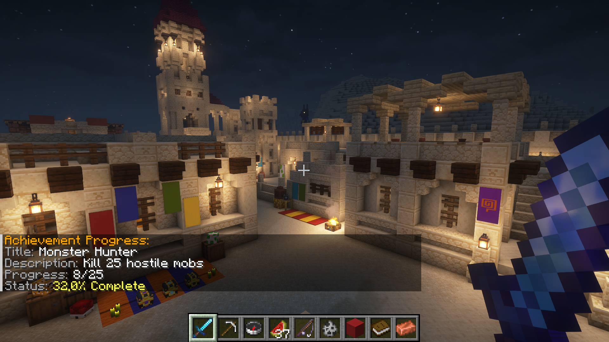
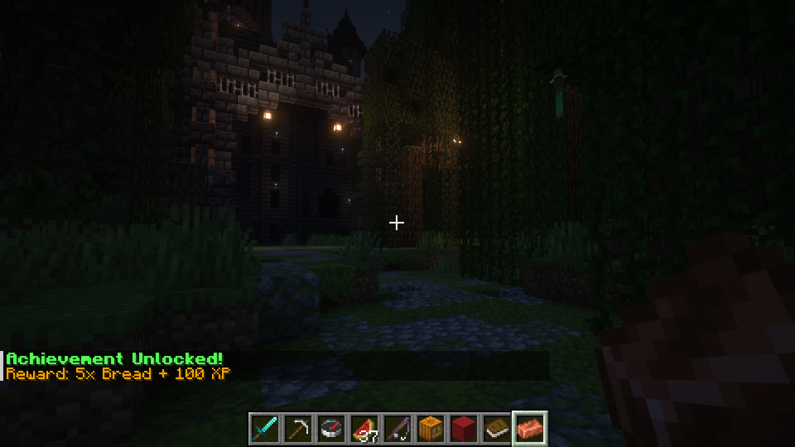
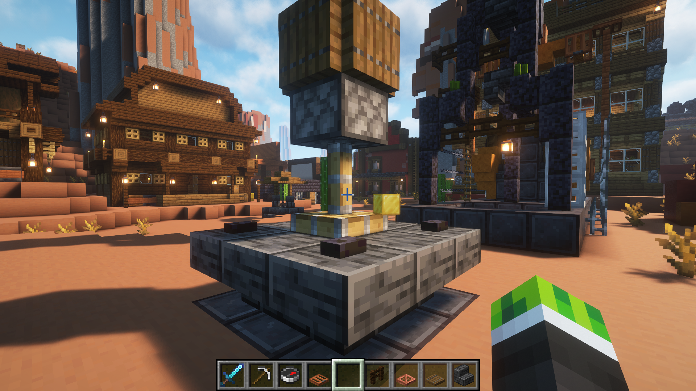
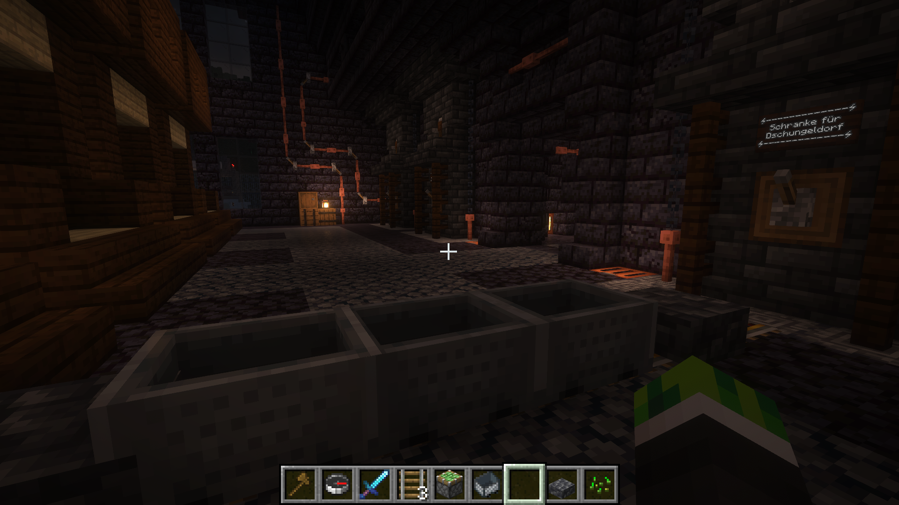
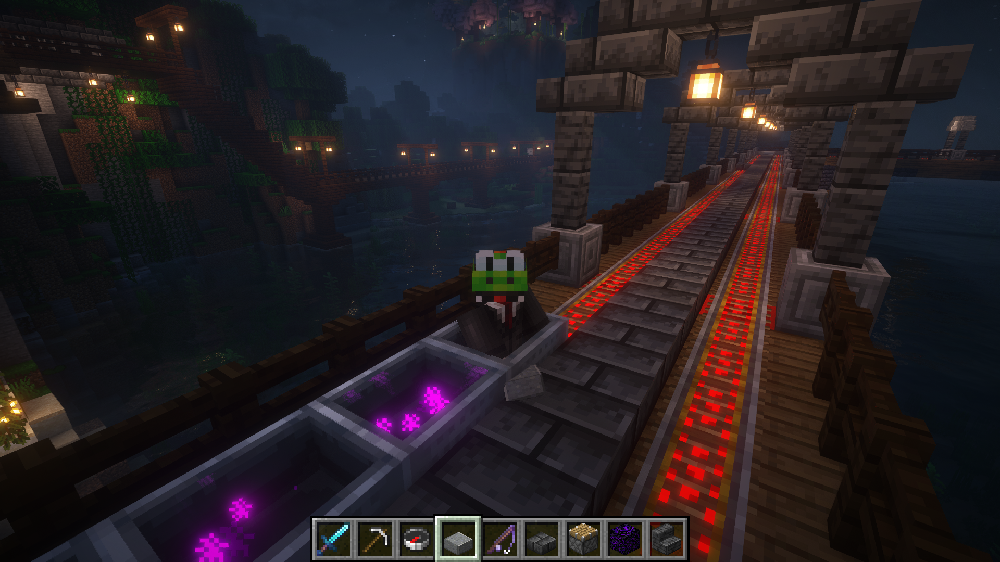
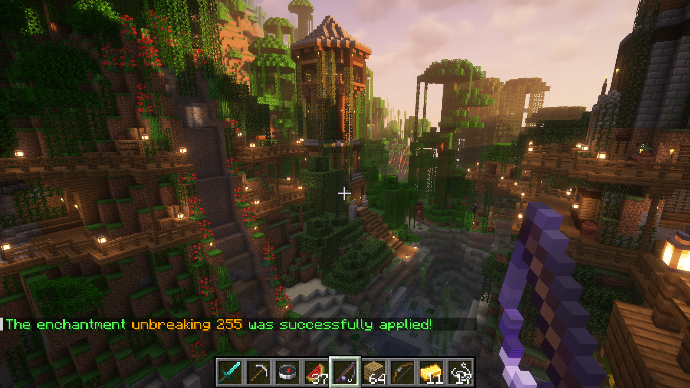

<p align="center">
  
</p>
<h1 align="center">Minecraft Server Plugins</h1>
<p align="center">
  <b>A collection of open-source Minecraft server plugins.</b><br>
  <b>Various enhancements for gameplay, administration, and server features.</b>
</p>
<p align="center">
  <a href="https://github.com/BerndHagen/Minecraft-Server-Plugins/releases"></a>&nbsp;&nbsp;<a href="https://github.com/BerndHagen/Minecraft-Server-Plugins/blob/main/LICENSE"></a>&nbsp;&nbsp;&nbsp;&nbsp;&nbsp;&nbsp;&nbsp;&nbsp;&nbsp;&nbsp;<a href="https://github.com/BerndHagen/Minecraft-Server-Plugins/issues"></a>
</p>

This collection provides **open-source Minecraft plugins** designed to add functionality to server gameplay. Each plugin is built with performance in mind and offers configuration options for server administrators.

Whether you're running a survival server, creative server, or custom game mode, these plugins provide additional features for your server. All plugins are released under the **MIT License**, allowing complete freedom to modify, distribute, and integrate them into your server environment.

### **Plugin Overview**

- **Advanced Achievements:** Comprehensive achievement system with custom rewards, progress tracking, and database integration
- **Piston Crusher:** Automated block crushing system using pistons with configurable materials and multipliers  
- **Rail Boost:** Enhanced minecart system with speed control, auto-pickup, storage, and advanced transportation features
- **Super Enchantments:** Advanced enchantment system allowing enchantments beyond vanilla limits with level 1-255 support

### **Key Features**

- **Open Source:** Complete source code available under MIT License for modification and improvement
- **Performance Optimized:** Efficient code designed for minimal server impact and smooth gameplay
- **Highly Configurable:** Extensive configuration options to customize behavior for your server needs
- **Database Integration:** Advanced data storage and player progress tracking capabilities
- **Modern API Support:** Built for Minecraft 1.19+ with backwards compatibility considerations
- **Admin Commands:** Comprehensive command systems for easy server management and configuration

### **Supported Platforms**

These plugins are compatible with major Minecraft server platforms:

- **Server Software:** `Spigot`, `Paper`, `Purpur`, `CraftBukkit`
- **Minecraft Versions:** `1.19+`, `1.20+`, `1.21+` (also compatible with higher versions)
- **Java Requirements:** `Java 17+`

### **Plugin Compatibility**

All plugins are designed to work seamlessly together and with popular server plugins:

- **Economy Integration:** Vault support for economy rewards and transactions
- **Permission Systems:** Compatible with LuckPerms, PermissionsEx, and other permission managers
- **WorldGuard Integration:** Respect region protections and building restrictions
- **Database Support:** MySQL, SQLite, and file-based storage options

## **Table of Contents**

1. [Getting Started](#getting-started)
    - [Prerequisites](#prerequisites)
    - [Installation Steps](#installation-steps)
    - [First Launch & Configuration](#first-launch--configuration)
    - [Verifying Installation](#verifying-installation)
2. [Advanced Achievements](#advanced-achievements)
    - [Core Features (Advanced Achievements)](#core-features-advanced-achievements)
    - [Administrative & Player Commands](#administrative--player-commands)
3. [Piston Crusher](#piston-crusher)
    - [Core Features (Piston Crusher)](#core-features)
    - [Example Setup (Piston Crusher)](#example-setup)
    - [Administrative Commands (Piston Crusher)](#administrative-commands)
4. [Rail Boost](#rail-boost)
    - [Core Features (Rail Boost)](#core-features-rail-boost)
    - [Player Commands (Rail Boost)](#player-commands)
5. [Super Enchantments](#super-enchantments)
    - [Core Features (Super Enchantments)](#core-features-super-enchantments)
    - [Player Commands (Super Enchantments)](#player-commands-1)
6. [License](#license)
7. [Screenshots](#screenshots)

## **Getting Started**

### **Prerequisites**
- Minecraft server 1.19 or higher (Spigot, Paper, or compatible fork)
- Java 17 or newer (Java 21 recommended)
- (Optional) Vault for economy features, LuckPerms or PermissionsEx for permissions, MySQL for advanced database support

### **Installation Steps**
1. Download the latest plugin `.jar` files from the [Releases](https://github.com/BerndHagen/Minecraft-Server-Plugins/releases) page.
2. Stop your Minecraft server if it is running.
3. Copy the downloaded `.jar` files into your server's `plugins` folder.
4. (Optional) Add Vault, LuckPerms, or other dependencies to the `plugins` folder if needed.
5. Start your server again.

### **First Launch & Configuration**
- On first start, each plugin will generate its own configuration files in the `plugins/PluginName/` directory.
- Edit these config files as needed, or use in-game commands for setup (see plugin sections below).

### **Verifying Installation**
- Use `/plugins` in-game to check if the plugins are loaded and active.
- Use `/version <PluginName>` to check the version and status of each plugin.
- If a plugin does not load, check the server console for error messages (e.g., missing dependencies or wrong Java version).

For plugin-specific commands and advanced configuration, see the sections below.

## **Advanced Achievements**

An advanced achievement system that tracks player progress for various task types (block breaking, crafting, mob kills, etc.) and provides highly configurable rewards. All progress and claim status are stored persistently per player. The plugin architecture allows for custom extensions via API.

### Core Features (Advanced Achievements):
- **Progress Tracking:** Real-time tracking for all task types (block breaking, crafting, mob kills, etc.)
- **Reward System:** Economy (Vault), items, XP, titles, commands – all configurable per achievement
- **Database:** Supports MySQL and SQLite, including asynchronous load/save
- **GUI:** Inventory-based GUI with pages, navigation, and progress display (BossBar/ActionBar)
- **API:** Add custom achievements and triggers via API
- **Messages:** All messages and prefixes are fully customizable (YAML)
- **Prerequisites:** Achievements can depend on other achievements
- **Sound/Firework:** Unlocks can optionally play a sound and firework

### Administrative & Player Commands:

| Command | Description |
|---------|-------------|
| `/achievementadmin reload` | Reloads all configuration files and achievements |
| `/achievementadmin reset <player>` | Resets a player's progress |
| `/achievementadmin give <player> <id>` | Manually awards an achievement |
| `/achievementadmin create` | Starts an interactive creation dialog in chat |
| `/achievementadmin edit <id>` | Edits an existing achievement |
| `/achievementadmin delete <id>` | Permanently deletes an achievement |
| `/achievementadmin list [category] [page]` | Lists achievements with filtering and pagination |
| `/achievementadmin gui` | Opens the achievements GUI |
| `/achievementadmin info <id>` | Shows all details for an achievement |
| `/achievementadmin progress [id]` | Shows progress for all/specific achievements |
| `/achievementadmin help` | Shows all available commands |

**Aliases:** `/achadmin`, `/ach` (all subcommands as above)

## **Piston Crusher**

An automation plugin that allows pistons to crush only whitelisted blocks into multiple items, with a configurable multiplier. All settings can be changed live via command, no server restart required.

### Core Features:
- **Block Whitelist:** Only allowed blocks are crushed (configurable)
- **Output Multiplier:** Sets how many items are dropped per block
- **Crusher Block:** Must be movable by pistons (e.g., no obsidian, bedrock, etc.)
- **Tab Completion:** Available for all material names

### Example Setup

To build a working piston crusher, arrange the blocks in a straight line as follows:

```
[Piston] [Block to be crushed] [Crusher Block]
```

**How it works:**
- When the piston extends, it pushes the block to be crushed into the crusher block
- If the block to be crushed is on the whitelist, it will be destroyed and drop multiplied items according to the plugin settings
- The piston must be facing directly toward the block to be crushed, which is then directly adjacent to the crusher block

Make sure there is nothing blocking the piston from pushing the block into the crusher block. Only blocks on the whitelist will be crushed and multiplied.

### Administrative Commands:
| Command | Description |
|--------|--------------|
| `/pistoncrusher whitelist add <Material>` | Adds a block to the whitelist |
| `/pistoncrusher whitelist remove <Material>` | Removes a block from the whitelist |
| `/pistoncrusher whitelist list` | Shows all allowed blocks |
| `/pistoncrusher multiplier <Value>` | Sets the multiplier (e.g. 2.5) |
| `/pistoncrusher multiplier` | Shows the current multiplier |
| `/pistoncrusher crusherblock <Material>` | Sets the crusher block |
| `/pistoncrusher crusherblock` | Shows the current crusher block |

**Note:** Material names must be valid (`cobblestone`, `gold_block`, ...). Multiplier ≥ 1.0. Changes take effect immediately.

## **Rail Boost**

A minecart enhancement plugin that adds speed control, auto-pickup, inventory, magnetism, particles, chunkloading, and more – all individually configurable per minecart.

### Core Features (Rail Boost):
- **Speed Levels:** 6 levels (0.25x to 4.0x), switchable live
- **Auto-Pickup:** Items in a radius are automatically collected (radius configurable)
- **Inventory:** Each minecart has its own storage
- **Speedometer:** BossBar shows current speed
- **Chunkloading:** Minecarts keep chunks loaded
- **Magnetism:** Minecarts attract each other (optional)
- **Particle Effects:** Various particles selectable
- **Auto-Sit:** Automatic boarding
- **Blacklist:** Certain items are not picked up

### Player Commands:
| Command | Description |
|--------|--------------|
| `/railboost speed <1-6>` | Sets the speed |
| `/railboost autopickup <true/false>` | Enables/disables auto-pickup |
| `/railboost autopickup radius <1-5>` | Sets the pickup radius |
| `/railboost storage` | Opens the minecart inventory |
| `/railboost speedometer <true/false>` | Shows/hides the BossBar |
| `/railboost chunkload <true/false>` | Chunkloading on/off |
| `/railboost magnet <true/false>` | Magnetism on/off |
| `/railboost effect <true/false>` | Particle effects on/off |
| `/railboost effect type <Particle>` | Sets the particle type |
| `/railboost autosit <true/false>` | Automatic boarding |
| `/railboost blacklist add <Item>` | Adds an item to the blacklist |
| `/railboost blacklist remove <Item>` | Removes an item from the blacklist |
| `/railboost blacklist list` | Shows the blacklist |
| `/railboost configuration <true/false>` | Enables/disables RailBoost for the minecart |
| `/railboost info` | Shows all settings |
| `/railboost help` | Help for all commands |

**Aliases:** `/rb` – Booleans: `true/false`, `on/off`, `1/0`. Most commands require you to be sitting in the minecart and it to be activated (`/railboost configuration true`).

## **Super Enchantments**

A powerful enchantment system that allows players to apply all vanilla enchantments with levels 1–255, with full compatibility checks and context-aware tab completion. Clear error and success messages for all operations.

### Core Features (Super Enchantments):
- **Level 1–255:** All vanilla enchantments, level freely selectable
- **Compatibility Check:** Only valid enchantments for the held item are allowed
- **Tab Completion:** Only shows valid enchantments for the held item
- **Default Level:** If not specified, uses the vanilla maximum
- **Permissions:** Configurable access for all commands
- **Feedback:** Clear error and confirmation messages

### Player Commands:
| Command | Description |
|--------|--------------|
| `/superenchant <enchantment> [level]` | Enchants the item in your hand |
| `/enchantlist` | Shows all possible enchantments for the item |
| `/senchant ...`, `/se ...`, `/elist`, `/el` | Short commands for quick enchanting |

**Notes:**
- Item must be enchantable and held in the main hand
- Level range: 1–255
- Tab completion and error checking prevent invalid input

## **License**

This project is licensed under the **MIT License** - see the [LICENSE](LICENSE) file for details.

## **Screenshots**

The following screenshots demonstrate the core functionality of each plugin, including the achievement system interface, automation, and enhanced minecart features.

## **Screenshots**

The following screenshots demonstrate the core functionality of each plugin, including the achievement system interface, automation, and enhanced minecart features.

## **Screenshots**

The following screenshots demonstrate the core functionality of each plugin, including the achievement system interface, automation, and enhanced minecart features.

| Plugin - Achievement | Plugin - Achievement  | Plugin - Crusher |
|:----------------------------:|:----------------------------:|:----------------------:|
| [](https://github.com/BerndHagen/Minecraft-Server-Plugins/raw/main/img/img_v1.0.1-mcplugin-progress.png) | [](https://github.com/BerndHagen/Minecraft-Server-Plugins/raw/main/img/img_v1.0.1-mcplugin-unlocked.png) | [](https://github.com/BerndHagen/Minecraft-Server-Plugins/raw/main/img/img_v1.0.1-mcplugin-crusher.png) |

| Plugin - Railboost | Plugin - Railboost | Plugin - Enchantments |
|:----------------------------:|:----------------------------:|:----------------------:|
| [](https://github.com/BerndHagen/Minecraft-Server-Plugins/raw/main/img/img_v1.0.1-mcplugin-magnet.png) | [](https://github.com/BerndHagen/Minecraft-Server-Plugins/raw/main/img/img_v1.0.1-mcplugin-effect.png) | [](https://github.com/BerndHagen/Minecraft-Server-Plugins/raw/main/img/img_v1.0.1-mcplugin-enchantment.png) |
