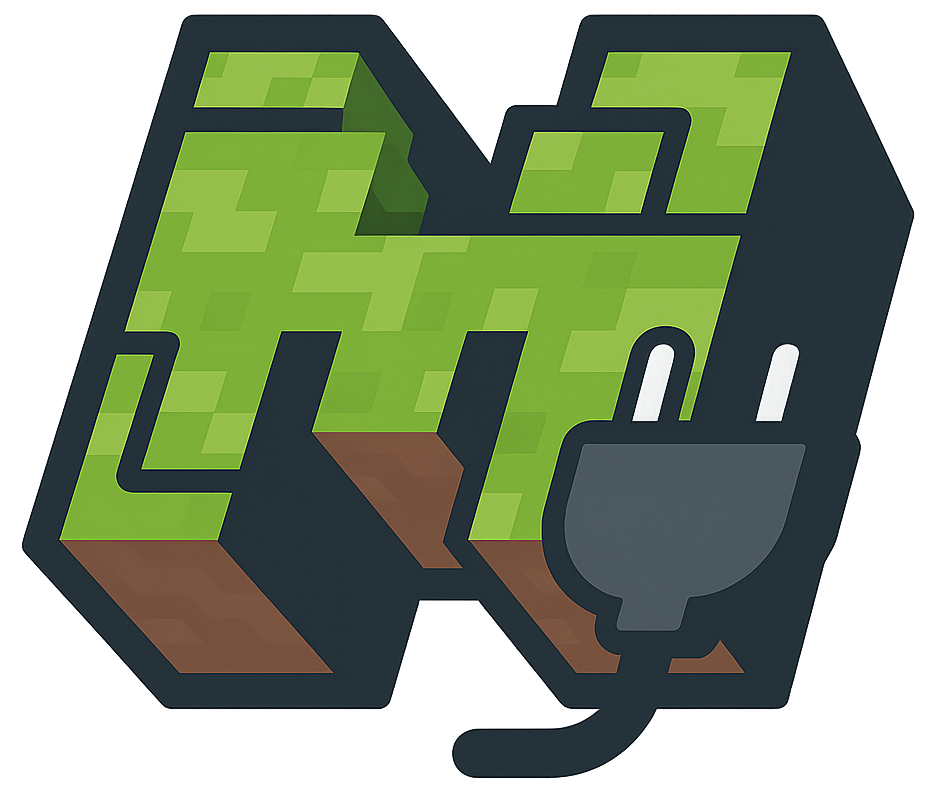

<p align="center">
  
</p>
<h1 align="center">Minecraft Server Plugins</h1>
<p align="center">
  <b>A collection of open-source Minecraft server plugins.</b><br>
  <b>Various enhancements for gameplay, administration, and server features.</b>
</p>
<p align="center">
  <a href="https://github.com/BerndHagen/Minecraft-Server-Plugins/releases"></a>&nbsp;&nbsp;<a href="https://github.com/BerndHagen/Minecraft-Server-Plugins/blob/main/LICENSE"></a>&nbsp;&nbsp;&nbsp;&nbsp;&nbsp;&nbsp;&nbsp;&nbsp;&nbsp;&nbsp;<a href="https://github.com/BerndHagen/Minecraft-Server-Plugins/issues"></a>
</p>

This collection provides **open-source Minecraft plugins** designed to add functionality to server gameplay. Originally developed for an own Minecraft server to enhance industrial automation, area protection, and backup capabilities, these plugins are now shared with the community to benefit other server administrators.

Each plugin is built with performance in mind and offers extensive configuration options for server administrators. Whether you're running a survival server, creative server, or custom game mode, these plugins provide additional features for your server. All plugins are released under the **MIT License**, allowing complete freedom to modify, distribute, and integrate them into your server environment.

### **Plugin Overview**

- **Advanced Achievements:** Comprehensive achievement system with custom rewards, progress tracking, and database integration
- **Area Rewind:** Advanced area protection and backup system with undo/redo functionality, automatic backups, and GUI management
- **Piston Crusher:** Automated block crushing system using pistons with configurable materials and multipliers  
- **Rail Boost:** Enhanced minecart system with speed control, auto-pickup, storage, and advanced transportation features
- **Super Enchantments:** Advanced enchantment system allowing enchantments beyond vanilla limits with level 1-255 support

### **Key Features**

- **Open Source:** Complete source code available under MIT License for modification and improvement
- **Performance Optimized:** Efficient code designed for minimal server impact and smooth gameplay
- **Highly Configurable:** Extensive configuration options to customize behavior for your server needs
- **Database Integration:** Advanced data storage and player progress tracking capabilities
- **Modern API Support:** Built for Minecraft 1.21+ with backwards compatibility considerations
- **Admin Commands:** Comprehensive command systems for easy server management and configuration
- **GUI Interfaces:** User-friendly graphical interfaces for easy management and configuration

### **Supported Platforms**

These plugins are compatible with major Minecraft server platforms:

- **Server Software:** `Spigot`, `Paper`, `Purpur`, `CraftBukkit`
- **Minecraft Versions:** `1.21.3`, `1.21.4`, `1.21.5`, `1.21.6`, `1.21.7`, `1.21.8` (also compatible with higher versions)
- **Java Requirements:** `Java 17+`

### **Plugin Compatibility**

All plugins are designed to work seamlessly together and with popular server plugins:

- **Economy Integration:** Vault support for economy rewards and transactions
- **Permission Systems:** Compatible with LuckPerms, PermissionsEx, and other permission managers
- **WorldGuard Integration:** Respect region protections and building restrictions
- **Database Support:** MySQL, SQLite, and file-based storage options

## **Table of Contents**

1. [Getting Started](#getting-started)
    - [Prerequisites](#prerequisites)
    - [Installation Steps](#installation-steps)
    - [First Launch & Configuration](#first-launch--configuration)
    - [Verifying Installation](#verifying-installation)
2. [Advanced Achievements](#advanced-achievements)
    - [Core Features](#core-features)
    - [Administrative & Player Commands](#administrative--player-commands)
3. [Area Rewind](#area-rewind)
    - [Core Features](#core-features-1)
    - [Getting Started](#getting-started-1)
    - [Player Commands](#player-commands)
    - [Administrative Commands](#administrative-commands)
4. [Piston Crusher](#piston-crusher)
    - [Core Features](#core-features-2)
    - [Example Setup](#example-setup)
    - [Administrative Commands](#administrative-commands-1)
5. [Rail Boost](#rail-boost)
    - [Core Features](#core-features-3)
    - [Player Commands](#player-commands-1)
6. [Super Enchantments](#super-enchantments)
    - [Core Features](#core-features-4)
    - [Player Commands](#player-commands-2)
7. [License](#license)
8. [Screenshots](#screenshots)

## **Getting Started**

### **Prerequisites**
- Minecraft server 1.21 or higher (Spigot, Paper, or compatible fork)
- Java 17 or newer (Java 21 recommended)
- (Optional) Vault for economy features, LuckPerms or PermissionsEx for permissions, MySQL for advanced database support

### **Installation Steps**
1. Download the latest plugin `.jar` files from the [Releases](https://github.com/BerndHagen/Minecraft-Server-Plugins/releases) page.
2. Stop your Minecraft server if it is running.
3. Copy the downloaded `.jar` files into your server's `plugins` folder.
4. (Optional) Add Vault, LuckPerms, or other dependencies to the `plugins` folder if needed.
5. Start your server again.

### **First Launch & Configuration**
- On first start, each plugin will generate its own configuration files in the `plugins/PluginName/` directory.
- Edit these config files as needed, or use in-game commands for setup (see plugin sections below).

### **Verifying Installation**
- Use `/plugins` in-game to check if the plugins are loaded and active.
- Use `/version <PluginName>` to check the version and status of each plugin.
- If a plugin does not load, check the server console for error messages (e.g., missing dependencies or wrong Java version).

For plugin-specific commands and advanced configuration, see the sections below.

## **Advanced Achievements**

An advanced achievement system that tracks player progress for various task types (block breaking, crafting, mob kills, etc.) and provides highly configurable rewards. All progress and claim status are stored persistently per player. The plugin architecture allows for custom extensions via API.

### Core Features:
- **Progress Tracking:** Real-time tracking for all task types (block breaking, crafting, mob kills, etc.)
- **Reward System:** Economy (Vault), items, XP, titles, commands – all configurable per achievement
- **Database:** Supports MySQL and SQLite, including asynchronous load/save
- **GUI:** Inventory-based GUI with pages, navigation, and progress display (BossBar/ActionBar)
- **API:** Add custom achievements and triggers via API
- **Messages:** All messages and prefixes are fully customizable (YAML)
- **Prerequisites:** Achievements can depend on other achievements
- **Sound/Firework:** Unlocks can optionally play a sound and firework

### Administrative & Player Commands:

| Command | Description |
|---------|-------------|
| `/achievementadmin reload` | Reloads all configuration files and achievements |
| `/achievementadmin reset <player>` | Resets a player's progress |
| `/achievementadmin give <player> <id>` | Manually awards an achievement |
| `/achievementadmin create` | Starts an interactive creation dialog in chat |
| `/achievementadmin edit <id>` | Edits an existing achievement |
| `/achievementadmin delete <id>` | Permanently deletes an achievement |
| `/achievementadmin list [category] [page]` | Lists achievements with filtering and pagination |
| `/achievementadmin gui` | Opens the achievements GUI |
| `/achievementadmin info <id>` | Shows all details for an achievement |
| `/achievementadmin progress [id]` | Shows progress for all/specific achievements |
| `/achievementadmin help` | Shows all available commands |

**Aliases:** `/achadmin`, `/ach` (all subcommands as above)

## **Area Rewind**

A comprehensive area protection and backup system that allows players to create protected zones with automatic backups, undo/redo functionality, and advanced visualization features. Perfect for servers that need reliable area management with rollback capabilities.

### Core Features:
- **Area Protection:** Create protected areas with position selection using wooden hoe tool
- **Automatic Backups:** Scheduled backups with configurable intervals and retention policies
- **Manual Backups:** Create backups on demand for important moments
- **Undo/Redo System:** Full undo/redo functionality for area changes with history tracking
- **Restoration System:** Restore areas to any previous backup state with preview functionality
- **Permission System:** Owner and trusted player system with granular permissions
- **GUI Interface:** User-friendly inventory-based GUI for area and backup management
- **Visualization:** Particle-based area boundary visualization with customizable effects
- **Interval Restoration:** Automatic restoration on configurable intervals for specific uses
- **Block State Support:** Full support for containers with contents (chests, barrels, etc.), signs with text, banners with patterns, and all complex block states
- **Rollback System:** Time-based rollback functionality (e.g., restore to 2 hours ago)
- **Preview System:** Preview backup states before restoration with particle effects
- **Database Storage:** Persistent storage with file-based backup system

### Getting Started:
1. **Selection:** Use a wooden hoe to select two corners of your area (left-click pos1, right-click pos2)
2. **Creation:** Use `/rewind save <name>` to create a protected area
3. **Backup:** Use `/rewind backup <area>` to create manual backups
4. **Management:** Use `/rewind gui` for easy graphical management

### Player Commands:

| Command | Description |
|---------|-------------|
| `/rewind pos1` | Set position 1 to block you're looking at |
| `/rewind pos2` | Set position 2 to block you're looking at |
| `/rewind save <name>` | Create protected area with current selection |
| `/rewind list [owned/trusted/all]` | List protected areas with filtering |
| `/rewind info <area>` | Show detailed information about an area |
| `/rewind teleport <area>` | Teleport to the center of an area |
| `/rewind backup <area>` | Create manual backup of an area |
| `/rewind restore <area> <backup_id/latest/oldest>` | Restore area from backup |
| `/rewind undo <area>` | Undo last change to area |
| `/rewind redo <area>` | Redo last undone change |
| `/rewind history <area> [page]` | View backup history with pagination |
| `/rewind rollback <area> <time>` | Rollback to specific time (e.g., 2h, 30m, 1d) |
| `/rewind preview <area> <backup_id>` | Preview backup with particles |
| `/rewind show <area>` | Visualize area boundaries |
| `/rewind gui` | Open graphical interface |

### Administrative Commands:

| Command | Description |
|---------|-------------|
| `/rewind delete <area>` | Delete area and all its backups |
| `/rewind rename <old_name> <new_name>` | Rename an area |
| `/rewind contract <area> <direction> <amount>` | Shrink area in specified direction |
| `/rewind trust <area> <player>` | Add trusted player to area |
| `/rewind untrust <area> <player>` | Remove trusted player from area |
| `/rewind permissions <area>` | View area permissions and trusted players |
| `/rewind cleanup <area> [days]` | Clean up old backups (default: 7 days) |
| `/rewind scan <area>` | Scan for changes since last backup |
| `/rewind diff <area> <id1> <id2>` | Compare two backups |
| `/rewind interval <area> <minutes> <backup_id>` | Set auto-restore interval |
| `/rewind particle <name>` | Set particle type for visualizations |
| `/rewind status` | Show plugin status and statistics |
| `/rewind reload` | Reload plugin configuration |

**Aliases:** `/ar`, `/arearewind` – **Tool:** Wooden Hoe for area selection

## **Piston Crusher**

An automation plugin that allows pistons to crush only whitelisted blocks into multiple items, with a configurable multiplier. All settings can be changed live via command, no server restart required.

### Core Features:
- **Block Whitelist:** Only allowed blocks are crushed (configurable)
- **Output Multiplier:** Sets how many items are dropped per block
- **Crusher Block:** Must be movable by pistons (e.g., no obsidian, bedrock, etc.)
- **Tab Completion:** Available for all material names

### Example Setup

To build a working piston crusher, arrange the blocks in a straight line as follows:

```
[Piston] [Block to be crushed] [Crusher Block]
```

**How it works:**
- When the piston extends, it pushes the block to be crushed into the crusher block
- If the block to be crushed is on the whitelist, it will be destroyed and drop multiplied items according to the plugin settings
- The piston must be facing directly toward the block to be crushed, which is then directly adjacent to the crusher block

Make sure there is nothing blocking the piston from pushing the block into the crusher block. Only blocks on the whitelist will be crushed and multiplied.

### Administrative Commands:
| Command | Description |
|--------|--------------|
| `/pistoncrusher whitelist add <Material>` | Adds a block to the whitelist |
| `/pistoncrusher whitelist remove <Material>` | Removes a block from the whitelist |
| `/pistoncrusher whitelist list` | Shows all allowed blocks |
| `/pistoncrusher multiplier <Value>` | Sets the multiplier (e.g. 2.5) |
| `/pistoncrusher multiplier` | Shows the current multiplier |
| `/pistoncrusher crusherblock <Material>` | Sets the crusher block |
| `/pistoncrusher crusherblock` | Shows the current crusher block |

**Note:** Material names must be valid (`cobblestone`, `gold_block`, ...). Multiplier ≥ 1.0. Changes take effect immediately.

## **Rail Boost**

A comprehensive minecart enhancement plugin that transforms vanilla minecart transportation into a powerful and customizable system. Each minecart can be individually configured with speed levels, automated item collection, built-in storage, and advanced physics improvements for reliable rail-based transportation networks.

### Core Features:
- **Speed Control:** 6 configurable speed levels (0.25x to 4.0x) with intelligent physics handling for curves and uphill sections
- **Auto-Pickup System:** Automatic item collection within configurable radius (1-5 blocks) with customizable blacklist filtering
- **Storage Integration:** Each minecart has its own 27-slot inventory accessible via GUI, with automatic item sorting
- **Advanced Physics:** Enhanced curve navigation, uphill momentum preservation, and anti-stuck mechanisms for smooth travel
- **Magnetism System:** Optional minecart-to-minecart attraction for train formation with intelligent collision prevention
- **Visual Effects:** Customizable particle trails with intensity scaling based on speed and multiple particle types
- **Performance Tools:** Real-time speedometer with BossBar display showing current velocity in km/h
- **Automation Features:** Auto-sit functionality for seamless boarding and chunkloading for uninterrupted long-distance travel
- **Persistent Configuration:** All settings are saved per-minecart and persist through server restarts

### Player Commands:
| Command | Description |
|---------|-------------|
| `/railboost speed <1-6>` | Sets speed level (0.25x to 4.0x multiplier) |
| `/railboost autopickup <true/false>` | Toggles automatic item collection |
| `/railboost autopickup radius <1-5>` | Sets pickup radius in blocks |
| `/railboost storage` | Opens minecart's dedicated inventory |
| `/railboost speedometer <true/false>` | Shows/hides real-time speed display |
| `/railboost chunkload <true/false>` | Enables chunk loading while traveling |
| `/railboost magnet <true/false>` | Toggles minecart magnetism for train formation |
| `/railboost effect <true/false>` | Enables particle trail effects |
| `/railboost effect type <particle>` | Sets particle type (FLAME, HEART, CLOUD, etc.) |
| `/railboost autosit <true/false>` | Automatic boarding when approaching minecart |
| `/railboost blacklist add/remove <item>` | Manages auto-pickup item filter |
| `/railboost blacklist list` | Shows current blacklisted items |
| `/railboost info` | Displays all current minecart settings |

**Note:** Most commands require sitting in an activated minecart. Use `/railboost info` to verify activation status.

**Aliases:** `/rb` – **Activation:** Automatic when using any command while in a minecart

## **Super Enchantments**

A powerful enchantment system that allows players to apply all vanilla enchantments with levels 1–255, with full compatibility checks and context-aware tab completion. Clear error and success messages for all operations.

### Core Features:
- **Level 1–255:** All vanilla enchantments, level freely selectable
- **Compatibility Check:** Only valid enchantments for the held item are allowed
- **Tab Completion:** Only shows valid enchantments for the held item
- **Default Level:** If not specified, uses the vanilla maximum
- **Permissions:** Configurable access for all commands
- **Feedback:** Clear error and confirmation messages

### Player Commands:
| Command | Description |
|--------|--------------|
| `/superenchant <enchantment> [level]` | Enchants the item in your hand |
| `/enchantlist` | Shows all possible enchantments for the item |
| `/senchant ...`, `/se ...`, `/elist`, `/el` | Short commands for quick enchanting |

**Notes:**
- Item must be enchantable and held in the main hand
- Level range: 1–255
- Tab completion and error checking prevent invalid input

## **License**

This project is licensed under the **MIT License** - see the [LICENSE](LICENSE) file for details.

## **Screenshots**

The following screenshots demonstrate the core functionality of each plugin, including the achievement system interface, area protection and backup management, automation, and enhanced minecart features.

<table>
  <tr>
    <th>Plugin - Advanced Achievement</th>
    <th>Plugin - Advanced Achievement</th>
    <th>Plugin - Area Rewind</th>
  </tr>
  <tr>
    <td><a href="https://github.com/BerndHagen/Minecraft-Server-Plugins/raw/main/img/img_v1.0.1-mcplugin-progress.png" target="_blank" rel="noopener noreferrer">
      
    </a></td>
    <td><a href="https://github.com/BerndHagen/Minecraft-Server-Plugins/raw/main/img/img_v1.0.1-mcplugin-unlocked.png" target="_blank" rel="noopener noreferrer">
      
    </a></td>
    <td><a href="https://github.com/BerndHagen/Minecraft-Server-Plugins/raw/main/img/img_v1.0.1-mcplugin-arearewind.png" target="_blank" rel="noopener noreferrer">
      
    </a></td>
  </tr>
  <tr>
    <th>Plugin - Piston Crusher</th>
    <th>Plugin - Railboost</th>
    <th>Plugin - Super Enchantments</th>
  </tr>
  <tr>
    <td><a href="https://github.com/BerndHagen/Minecraft-Server-Plugins/raw/main/img/img_v1.0.1-mcplugin-crusher.png" target="_blank" rel="noopener noreferrer">
      
    </a></td>
    <td><a href="https://github.com/BerndHagen/Minecraft-Server-Plugins/raw/main/img/img_v1.0.1-mcplugin-effect.png" target="_blank" rel="noopener noreferrer">
      
    </a></td>
    <td><a href="https://github.com/BerndHagen/Minecraft-Server-Plugins/raw/main/img/img_v1.0.1-mcplugin-enchantment.png" target="_blank" rel="noopener noreferrer">
      
    </a></td>
  </tr>
</table>
